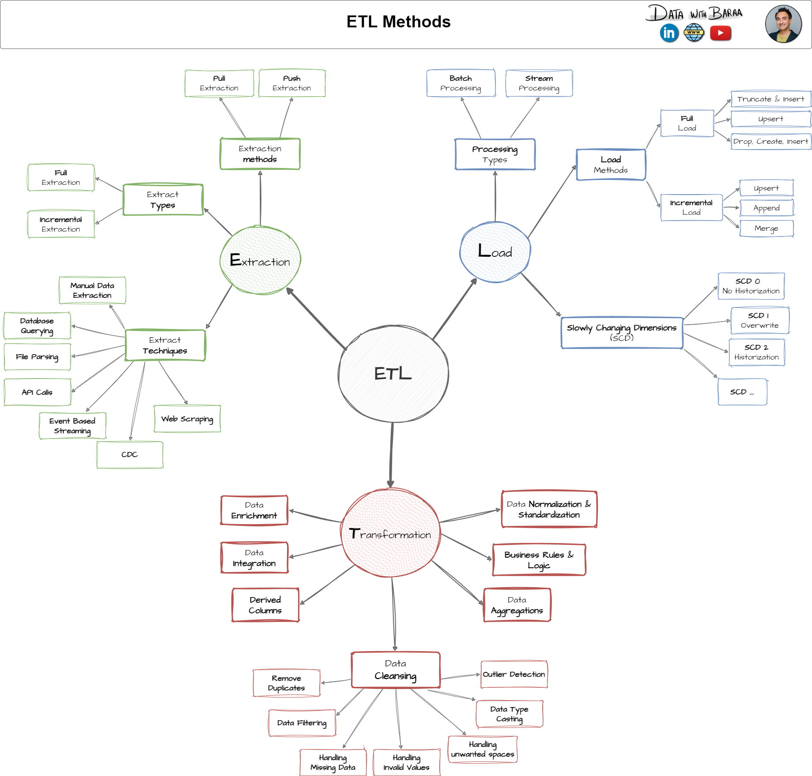

# 📦 Building-Modern-SQL-Datawarehouse
**📢 Welcome to the Building Data Warehouse Repository!**

This project demonstrates how to design and build a modern data warehouse from scratch using **SQL**, following real-world architectural practices used in industry.

🔍 It walks through the full data lifecycle:
- Ingesting raw data into a staging layer
- Designing normalized and dimensional models
- Creating optimized **fact and dimension tables** in a **star schema**
- Preparing data for business-ready analytics

__________________________________________________________________________________________________________________________________________________________________
## 🏢 Data Warehouse

A data warehouse is a central place where data from different sources is brought together, cleaned up, and stored over time so it can be used for reporting, analysis, and business decisions.
This definition is based on the work of **Bill Inmon**, widely known as the *"Father of the Data Warehouse"*. He described a data warehouse as being:

- 🎯 **Subject-oriented** – Organized by topic (like sales, customers, or products)  
- 🔗 **Integrated** – Combines data from different systems into a consistent format  
- ⏳ **Time-variant** – Stores historical data to track changes over time  
- 🚫 **Non-volatile** – Data stays unchanged once it's added, ensuring consistency

__________________________________________________________________________________________________________________________________________________________________________
## 🔄 ETL Process Overview

**ETL** stands for **Extract, Transform, Load**. This is a key process in building and maintaining data warehouses. It involves:

* **Extracting** data from various sources
* **Transforming** the data to clean, standardize, and apply business rules
* **Loading** the processed data into the data warehouse for analysis and reporting

## 🏗️ ETL in This Project

This project implements a complete ETL pipeline with the following details:

### 📥 Extract

The **pull method**  is used to extract data from source files using a **full load** strategy. The extraction involves reading structured data files (CSV).

### 🔧 Transform

A variety of **data cleansing and transformation techniques** were applied to ensure quality and consistency:

* ✅ **Remove duplicates**
* 🔍 **Data filtering** based on business criteria
* ⚠️ **Handling missing data** (e.g., filling with default or null)
* 🚫 **Handling invalid values**
* ✂️ **Trimming unwanted spaces**
* 🔄 **Type casting** (e.g., string to integer/date)
* 💡 **Data enrichment** by adding derived or calculated columns
* 🧮 **Derived columns** (e.g., total\_price = quantity × unit\_price)
* 🎯 **Normalization and standardization** of values
* 🔗 **Data integration** from multiple sources into unified formats
* 🧠 **Business rules and logic** applied to meet real-world requirements

### 📤 Load

Data was loaded into the data warehouse using:

* **Batch processing** to group and insert records efficiently.
* **Full load** with a **truncate and insert** strategy to ensure fresh, consistent data for each pipeline run.

________________________________________________________________________________________________________________________________________________________________________________________________
## ✅ Tools Required

1. **[SQL Server Express](https://www.microsoft.com/en-us/sql-server/sql-server-downloads)** – Lightweight version of SQL Server used to host the data warehouse locally.

2. **[SQL Server Management Studio (SSMS)](https://learn.microsoft.com/en-us/sql/ssms/download-sql-server-management-studio-ssms)** – GUI to connect to SQL Server, run queries, create schema, and manage the database.

3. **[Notion](https://www.notion.so/)** – Used for project planning.

4. **[draw.io (diagrams.net)](https://www.diagrams.net/)** – Tool used to create ER diagrams and visualize the data warehouse architecture.

___________________________________________________________________________________________________________________________________________________________________________________________________
## 🧭 Project Planning Comes First

Before jumping into code or building any part of the data warehouse, **planning is a must**. For this project, all planning and task tracking is organized in **Notion**.

🔗 [Click here to view the full project plan in Notion](https://www.notion.so/Building-SQL-Data-Warehouse-2321ce15c2cc80c1a806c5075f81bfbc?source=copy_link)

___________________________________________________________________________________________________________________________________________________________________________________________________
## Project Begins Here
### 📌 Step 1: Requirement Analysis

#### 🔍 Here's What the Business Asked For:

* **Two sets of data** : We're given data from **two systems**. One that handles customer orders (ERP) and another that tracks customer interactions (CRM). Both are provided in CSV file format.

* **Clean and usable data** : We need to **fix issues in the data** before we use it. That means removing duplicates, filling in missing information, and making sure all values are valid and consistent.

* **Combine both data sources** : We’re expected to **merge the two datasets** into a single, simple format so that analysts can run reports and get insights easily.

* **Just the latest data** : We are only focusing on the **most recent records**. No need to track history or changes over time.

* **Good documentation** : We also need to **explain the final structure** clearly so that both technical and non-technical people can understand it.

### 📌 Step 2: Designing Data Architecture

**Using the Medallion Architecture**

This project follows the Medallion architecture, a common design pattern in modern data engineering. It organizes data into three layers:

* **Bronze**: Raw data from source systems, stored with minimal processing
* **Silver**: Cleaned and transformed data, ready for business use
* **Gold**: Final, aggregated data optimized for reporting and analytics


This warehouse implements the **Medallion Architecture**, enabling structured data processing in stages:

| Layer  | Description                                                                 |
|--------|-----------------------------------------------------------------------------|
| Bronze | Raw ingestion of ERP/CRM data using external tables                        |
| Silver | Standardized and joined dimension tables (customers, products, locations)  |
| Gold   | Analytical-ready fact tables like `sales_facts` for business use           |

📌 **Visualization:**
  
  


---

## 🔄 ETL Workflow Overview

1. **Bronze Layer**
   - Files: `ddl_bronze.sql`, `proc_load_bronze.sql`
   - Action: Load CSVs into raw staging tables (1:1 with source)

2. **Silver Layer**
   - Files: `ddl_silver.sql`, `proc_load_silver.sql`
   - Action: Clean nulls, normalize formats, apply business logic joins

3. **Gold Layer**
   - Files: `ddl_gold.sql`
   - Action: Final fact + dimension star schema (used for reporting)

---

## 📂 Project Structure

```
sql-data-warehouse-project-main/
│
├── datasets/
│   ├── source_crm/                  # Customer Info, Product Info, Sales Data (CRM)
│   └── source_erp/                  # Customer Hierarchies, Locations, Product Categories (ERP)
│
├── scripts/
│   ├── init_database.sql            # Schema and warehouse setup
│   ├── bronze/                      # Staging layer DDL + load procedures
│   ├── silver/                      # Cleaned layer DDL + procedures
│   └── gold/                        # Final star schema tables
│
├── docs/                            # Architecture diagrams and documentation
│   ├── data_architecture.png
│   ├── ETL.png
│   ├── data_flow.png
│   ├── Project_Notes_Sketches.pdf
│   └── data_layers.pdf
│
└── README.md
```

## 📌 SQL Features Demonstrated

- Relational modeling (3NF to Star Schema)
- Window functions, joins, and surrogate keys
- Modular stored procedures for staging and transformation
- Table normalization and data integrity
- External table loads and batch script execution

---

## 🚀 How to Run This Project

1. Set up a local SQL database (e.g., PostgreSQL)
2. Execute `init_database.sql` to create schemas
3. Load raw data using `bronze/proc_load_bronze.sql`
4. Run transformations in `silver/proc_load_silver.sql`
5. Query and analyze from gold-layer tables

---

## 📚 Documentation Highlights

- 📖 `docs/data_catalog.md`: Lists all source and target tables with mapping
- 🧠 `docs/naming_conventions.md`: Standardized column and table naming
- 🗺️ `docs/data_flow.png`: Shows how data flows layer by layer

---

## 👤 About the Author

**Deeba Farheen H N**  
Data Engineer | M.S. Data Science @ University of Michigan  
I specialize in building scalable data systems and transforming raw operational data into actionable intelligence.

- 🔗 [LinkedIn](https://linkedin.com/in/deeba-farheen-h-n)
- 💻 [GitHub](https://github.com/deebafar04)
- 📫 [deeba@umich.edu](mailto:deeba@umich.edu)

> 🌟 If you found this project helpful or insightful, feel free to star the repo and connect!

---


